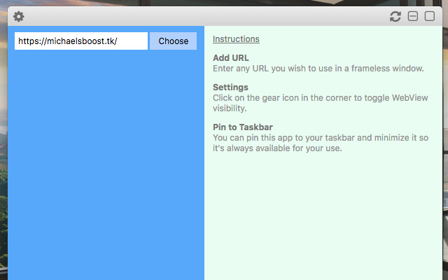

Frameless Window Wrapper for Chrome
===================

This is the source code for my Chrome application which can be viewed on the [Chrome Web Store](https://chrome.google.com/webstore/detail/frameless-window-wrapper/afammnlhelfghkcaaollfdnglinlgafl).

##### I personally have discontinued development of this application. However if you want any features (like no titlebar) please submit a pull request of your update/randition and it may get added into the next release.

  

Version
-------------

1.2.3

License
-------------

MIT

Tech
-------------

Why these libraries are used.

* [jQuery](http://jquery.com/) - duh
* [Normalize](https://necolas.github.io/normalize.css/) - css reset
* [Font Awesome](http://fontawesome.io/icons/) - for the beautiful icons within the titlebar

Development
-------------
Want to contribute? Great!

You can submit a pull request to improve the application for others or simply share the project :)

Of course this app is free and open source, so you can always fork the project and have fun :)

If it was at all helpful for you. You can show your appreciation by [Donating via SquareCash](https://cash.me/$michaelsboost) and/or [PayPal](https://www.paypal.me/mikethedj4)

Lastly you can also refer to the Official Google Chrome [Documentation](https://developer.chrome.com/extensions/api_index) for [Windows](https://developer.chrome.com/extensions/windows) and [WebView](https://developer.chrome.com/apps/tags/webview) API's.